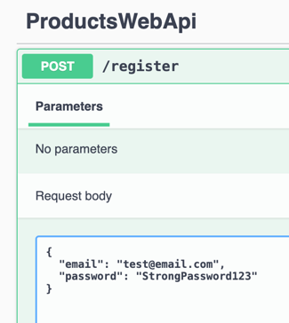
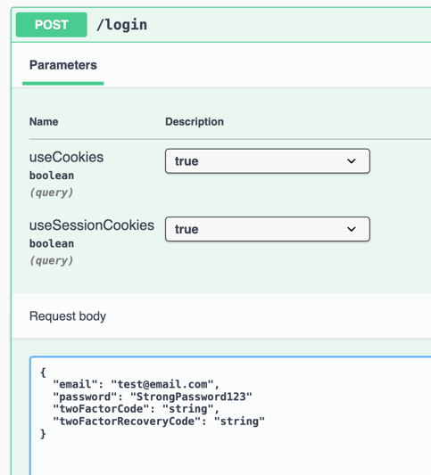

# Setup

## Database

There is a DB migration `20241023185654_InitialCreate.cs` that creates the initial schema for the database. The migration is located in the `Migrations` folder. To run the migration, execute the following command in the root of the project:

```bash
dotnet ef database update 
```

The connection string is located in the `appsettings.Development.json` file. The connection string is named `DefaultConnection`. Update the connection string to point to your database.

The ef core update command should create user related tables and a Product table.

## Authentication

I have used ASP.NET Core Identity for authentication.

Once the db migration is run, you can register a user by navigating to the `/Identity/Account/Register` route. After registering, you can login by navigating to the `/register` route to register a user.



Then to the `/login` route to login.



The authentication is done using a cookie which should be valid for 30 minutes.

## Requests

There is one controller in the project, the `ProductController`. The controller has the following three endpoints:

1. `GET /api/product` - This endpoint returns all the products in the database or a subset based on filter queries.
e.g. `api/Product?Colour=3&Price.From=10&Price.To=20`

