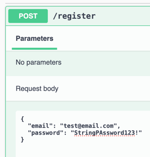
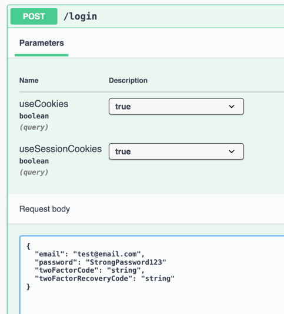
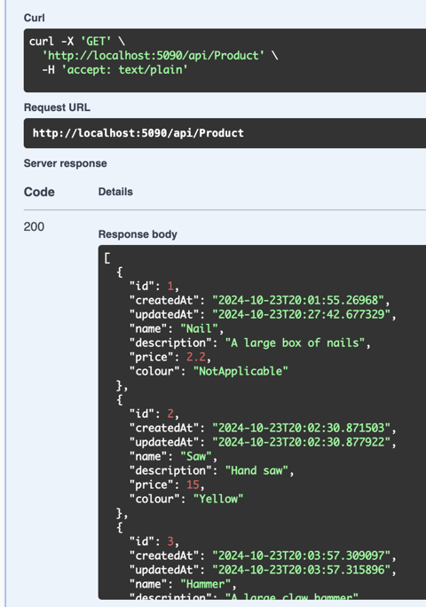
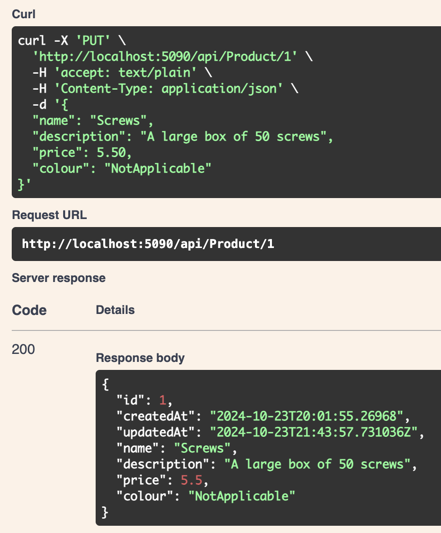

# Setup

## Database

There is a DB migration `20241023185654_InitialCreate.cs` that creates the initial schema for the database. The migration is located in the `Migrations` folder. To run the migration, execute the following command in the ProductsWebApi folder next to the csproj file:

```bash
dotnet ef database update 
```

The connection string is located in the `appsettings.Development.json` file. The connection string is named `DefaultConnection`. Update the connection string to point to your database.

> Note: I found I had to create the DB first before running the initial migration.

The ef core update command should create user related tables and a Product table.

## Authentication

I have used ASP.NET Core Identity for authentication.

Once the db migration is run, you can register a user by navigating to the `/register` endpoint.



After registering, you can log in by navigating to the `/login` endpoint.



The authentication is done using a cookie which should be valid for 30 minutes.

## Requests

There is one controller in the project, the `ProductController`. The controller has the following three endpoints:

1. `GET /api/product` - This endpoint returns all the products in the database or a subset based on filter queries.
e.g. `api/Product?Colour=Yellow&Price.From=10&Price.To=20`
2. `POST /api/product` - This endpoint creates a new product in the database.
3. `PUT /api/product/{id}` - This endpoint updates an existing product in the database.

## Testing

There is a Tests project with some example tests for the ProductRepository and ProductsQueryBuilder. 
The repository tests use an in-memory database to test the repository methods.

Given more time I would add integration tests which would test the endpoints using a test server or spin up a database with some seeded data in a docker container to test against.

## Example screenshots

I have included some example screenshots of the application running from swagger.

- Get all products


- Post a product


- Update a product
